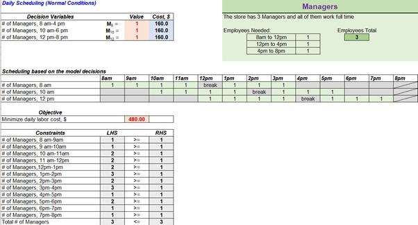
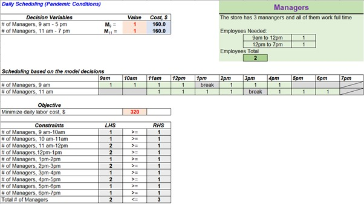
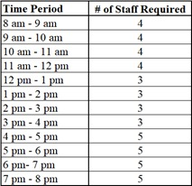
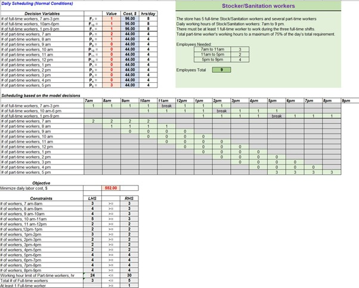
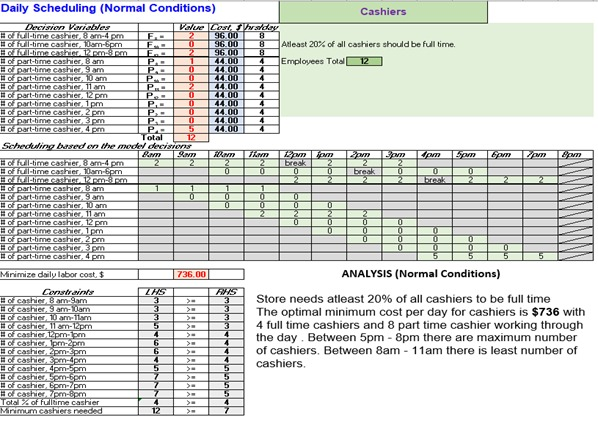
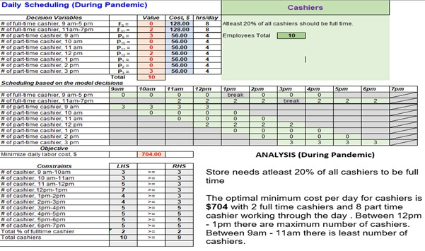
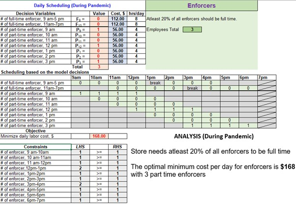
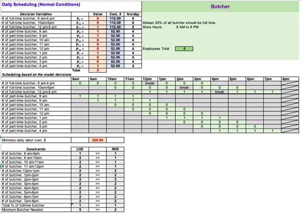
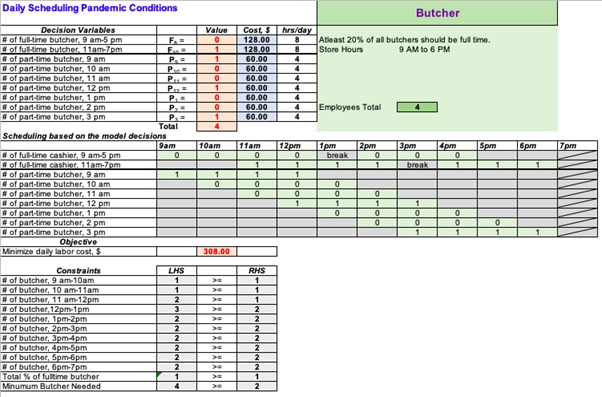

# Inventory and Labor Management

## Introduction
Innovation in the supply chain over the past few decades has helped grocery stores expand at unprecedented rates. This has created new challenges and opportunities in inventory management and labor management in these stores. One such problem that we are tackling in this project is employee scheduling. The goal of any grocery store is to be as efficient as possible and minimize costs while providing excellent service. There is an optimal requirement of employees at certain roles to maintain this kind of service and by including this in our model we can simulate the minimum cost required per day to run the grocery store. 
In this project we dug deep to find information on a grocery store in the San Francisco Bay Area that covers an area of roughly 12,000 square feet. This business has around 10 - 20 employees at any point and in normal conditions it operates seven days a week, from 8 AM to 8 PM. On average the store has around 25 to 30 customers shopping at any given time.  However, due to the emergence of COVID-19 and social distancing laws mandated by the government, factors such as store timings, wages and number of employees needed to run the store were affected. To stay in tune with reality we also created an employee scheduling model which simulates store requirement during the pandemic with revised wages, store timings and employees required for different roles.
The grocery store has a clear cut competitive and operational strategy. It wants to provide the best service to customers and that means having an adequate number of cashiers, timely stocking of items, regularly sanitizing the store and competent managers who can run the store. During times of pandemic the store does not mind investing in enforcers - whose job is to limit the number of people at the store, give customers free masks and provide sanitizing facilities upon entering the store. This operational strategy the store has adopted has given it a competitive advantage in that the shopping experience for a customer is hassle free. Customers can buy quality offerings confidently without being worried about hygiene 
and fast service ensures small wait times at the store.
	

## Market Research
Our group performed market research on how to run a grocery store and what would be needed to run a successful grocery store, looking at different aspects of the grocery store. Running an effective grocery store requires a variety of skills, from understanding the supply and demand of each product sold in the store, hiring employees with the knowledge of each department, keeping track of inventory, managing labor needs and cost, and etc. The hours of operations, size of the grocery store, maximum customers can fit into the store would also play a huge part in being successful in running a grocery store.
There are different departments within the grocery store that require staffing. Scheduling the correct labor plays a huge part in being successful in running a grocery store. Too less labor would increase longer waiting time for consumers, while scheduling too many labors would result in high labor costs with employees not as efficient. To run an efficient grocery store with the correct amount of labor, we would need to understand the grocery store operations. 
In this grocery store model, we are looking to optimize on scheduling of labor to provide the best service to customers and to minimize cost. There would be five different types of employees to look into: manager, cashier, stocker/sanitization, butcher, and new pandemic required enforcer. Each of these roles plays a huge part in running a successful grocery store. Given the current situation with the COVID-19, we are looking to provide two different models for scheduling labor for both before the pandemic and during the pandemic.

## What Problem Are We Solving
### Operating with 'Normal' Business Model

The first model we are looking at is the scheduling of labor before the pandemic time frame - the Normal Business Model. During the normal business times, the grocery store will be operating between 8 AM to 8 PM, 7 days a week. The maximum customers can come into the store are between 25 to 30 customers. Employees required are managers, cashiers, stockers, and butcher.
In this model, the objective for this is to find the minimum daily labor cost for each position. To do this we would be using the solver to help provide the best solution of how many employees needed the whole day for the grocery store to run efficiently and the cost to do this. The group would run each position with the solver based on our requirements for it to provide the optimized solution and to provide the cost for the whole day for each position. 

### Operating during the Pandemic Business Model

The first model we are looking at is the scheduling of labor before the pandemic time frame - the Normal Business Model. During the normal business times, the grocery store will be operating between 8 AM to 8 PM, 7 days a week. The maximum customers can come into the store are between 25 to 30 customers. Employees required are managers, cashiers, stockers, and butcher.
In this model, the objective for this is to find the minimum daily labor cost for each position. To do this we would be using the solver to help provide the best solution of how many employees needed the whole day for the grocery store to run efficiently and the cost to do this. The group would run each position with the solver based on our requirements for it to provide the optimized solution and to provide the cost for the whole day for each position. 

## Integer Linear Programing Model Formulation
### Managers
The grocery store now employs three full-time managers who work eight hours per day. Managers can take one-hour break after working four hours. In the normal business model, the store opens from 8AM to 8 PM and there are three full-time shifts available which are a shift from 8AM to 4 PM, a shift from 10AM to 6 PM, and a shift from 12 PM to 8 PM. The store requires at least one manager for each shift mentioned above to support the store daily operation. During the pandemic, the store updates its store hours to 9AM to 7 PM with two full-time shifts for managers instead, which are a 9AM to 5 PM shift and an 11AM to 7PM shift. Each shift requires at least one manager to work. Manager’s wage is $20 per hour ($160 per day) and it has not changed during the pandemic. The grocery store wants to set a schedule that would minimize its manager labor costs in the normal business model and pandemic business model.

We are using the Integer Linear Programming Model for the optimal solution of minimizing the daily labor cost for the manager. As we can see from Figure 1, under the normal business model situation, Solver gives the optimal solution that there are three managers needed for each shift per day from 8AM to 4 PM, 10 AM to 6 PM and 12 PM to 8 PM. All constraints and optimality conditions are satisfied. The minimum daily labor cost for the manager is $480. Three full time managers are a good solution for our objective and keeps the status quo.

During the pandemic, we can see from Figure 2, the optimal scheduling should be two full time managers working for each shift which is 9AM to 5 PM and 11AM to 7 PM. As originally there are three full time managers, so one manager should be moved to save the cost. The optimal solution to minimize the daily labor cost for the manager is $320. Compared with the normal business model situation, one manager can be moved and save the cost of $160 per day.

### Stocker/Sanitation Workers 
At this grocery store, stocker is also in charge of the sanitation work. Now this store employs five full-time stocker/sanitation workers who work eight hours daily, but also has several people available to work as part-time employees. The store requires two to four stock/sanitization workers depending on the time of the day. Each full-time worker must take a break after working four hours; each part-time worker must work four hours exactly in his/her shift. The store limits part-time hours to a maximum of 75% of a day’s total requirement. Full-time workers earn $12 per hour ($96 per day), and part-time workers earn $11 per hour ($44 per day). Stock/sanitization employees always start working one hour earlier than the store opening time and one hour later than the store closing time. In the normal business model, full-time stocker/sanitation workers have three shifts: 7AM to 3 PM, 10 AM to 6 PM, and 1 PM to 9 PM respectively. There must be at least one full-time stock/sanitation employee to work at the three shifts mentioned above.  The daily staffing requirements for the normal business model are showing below:

However, the store changes its operating hours during the pandemic. The grocery now opens from 9 AM to 7 PM and has two 8-hour shifts for full-time stock/sanitation employees which are a shift from 8AM to 4 PM and a shift from 12AM to 8 PM. At least one full-time worker should work during each full-time shift. The store also raises the labor rates of full-time and part-time stocker/sanitation workers. During the pandemic, full-time workers earn $16 per hour ($128 per day), and part-time workers earn $12 per hour ($48 per day). In order to fulfill the increasing customer demands, the store concludes an updated staffing requirement that are shown below: 

The grocery store wants to set a schedule that would minimize its stocker/sanitation worker labor costs in the normal business model and pandemic business model.

Under the normal business model situation, we can see from Figure 3, Solver gives the solution that the optimal scheduling for stocker/sanitation worker is one full time stocker/sanitation worker arranged for each shift of 7 AM to 3 PM, 10AM to 6 PM and 1 PM to 9 PM. Two part time stocker/sanitation workers start working at 7AM, one part time stocker/sanitation worker starts working at 8AM and three part time stocker/sanitation workers start working at 5 PM. Totally three full time stocker/sanitation workers and six part time stocker/sanitation workers need to be hired. The minimum daily labor cost for stocker/sanitation workers is $508.

During the pandemic, the grocery store decreased the opening hours, but increased the wages for the stocker / sanitation workers for compensation and motivation. After using the Solver, we can see from Figure 4, the optimal scheduling for full time stocker / sanitation workers is one stocker / sanitation worker working for shift 8 AM to 4 PM and two full stocker / sanitation workers working for shift 12 AM to 8 PM. For part time stocker/ sanitation workers, there are three start working at 8 AM, one start working at 9 AM and five start working at 4 PM. Totally three full time stocker / sanitation workers and nine part time stocker / sanitation workers need to be hired to satisfy the requirement under pandemic. The minimum daily labor cost for stocker / sanitation workers is $816. Compared with before the pandemic situation, even though the business hours have been reduced, due to increasing workload under pandemic, more part-time stocker / sanitation workers need to be hired and the hourly wage has been increased, the total labor cost has increased accordingly.

### Cashier 

Under normal conditions we can see from Figure 5, Solver gives a solution where optimal scheduling for cashiers is two full time cashiers between 8 AM and 4 PM and two full time cashiers between 12 PM to 8 PM. One part time cashier starts at 8 AM, two part time cashiers start at 11 AM and five part time cashiers start at 4 PM. There are a total of 4 full time cashiers and 8 part time cashiers. The optimal minimum cost per day is $736.

During the pandemic, the supermarket has limited store timings from 9 AM to 7 PM, but increased cashier wages to $15/ hr. After using the Solver, we can see from Figure 6, that the optimal scheduling for cashiers is two full time cashiers between 11 AM and 7 PM.  For part time cashiers, there are three part time cashiers starting at 9 AM, 2 starting at 12 PM and 3 starting at 3 PM. A total of 2 full time cashiers and 8 part time cashiers are needed to satisfy the requirement during pandemic. The minimum daily labor cost for cashiers is $704. Comparatively the business hours have been reduced and due to increasing workload during the pandemic, cashiers are hired at short notice and the hourly wage has been increased to meet this demand quickly.

### Enforcer

There is a new position the store is hiring for, during the pandemic called Enforcers. It is the job of an Enforcer to limit the number of people at the store, give customers free masks and provide sanitation facilities upon entering the store. We have used Integer Linear programming and after using the Solver, we can see from Figure 7, that the optimal scheduling for enforcers is to have 3 part time enforcers starting at 9 AM, 12 PM and 3 PM respectively. The minimum daily labor cost for enforcers is $168.

### Butcher

The butcher handles the meat department and assists customers with their meat products. The meat department would operate at the same time frame as the store hours, from 8 AM to 8 PM, during the normal business hours. At least 1 butcher is needed at the beginning when the store opens to handle the early comers. As the store progressed throughout the day, more butchers would be needed to accommodate the amount of customers in the store, we would need at least 2 butchers in the meat department as it gets busier. There should be at least 20 percent of butchers that are full time employees, while the other employees can be part time employees.

Figure 8 is the solution after using the solver to optimize our labor and cost. For a full time butcher, the wage is $14 per hour, and for a part time butcher, the wage is s $13 per hour. Since we required at least 20 percent of the butcher position to be full time employees, we set 3 different shifts, 8 AM to 4 PM, 10 AM to 6 PM, and 12 PM to 8 PM, with one lunch break after every 4 hours. While for the part time butcher position, we open up a shift each hour to allow the solver to provide the optimal solution. There should be at least 2 butcher in the meat department after 12 PM. 
After running the solver, the minimum required butchers we would need in the meat department would be a total of 5 butchers. There would only be 1 full time butcher for the day. The other 4 shifts would be all part time employees, each employee would have different shifts, starting at 8 AM to 12 PM, 9 AM to 1 PM, 1 PM to 5 PM, and 4 PM to 8 PM. The minimum daily labor cost for the butcher position would be $320.00. 
The butcher position would change during the pandemic time, as the grocery store hours would decrease to 9 AM to 6 PM. The stay at home order and social distancing order is in place during the pandemic time, which resulted in fewer customers coming into the grocery store, and only a maximum of 12 customers to be in the grocery store. Although the store hours adjusted, the requirements for butcher position would still be the same. The butcher position should at least have 20 percent of employees are full time positions and at least 2 butchers required after 12 PM. The part time scheduled shift would open up after each hour to allow the solver to provide the optimized solution for scheduling.

Figure 9 shows the solution after using the solver to optimize the labor and cost. For a full time butcher during the pandemic time, the wage is $15 per hour, and for a part time butcher, the wage is s $14 per hour. One constraint we required is to have at least 20 percent of the butcher position to be full time employees. The different shifts provided for full time employees were set up at 9 AM to 5 PM and 11 AM to 7 PM, with one lunch break after every 4 hours. While for the part time butcher position, we open up a shift each hour to allow the solver to provide the optimal solution. There should be at least 2 butchers in the meat department after 12 PM.
After running the solver, the minimum required butchers we would need in the meat department would be a total of 4 butchers. This number is lesser because the store hours during the pandemic time are shorter than the normal business hours. There would only be 1 full time butcher for the day, starting from 11 AM to 7 PM. The other 3 shifts would be part time butchers, starting at 9 AM to 1 PM, 12 PM to 4 PM, and 3 PM to 7 PM. The minimum daily labor cost for the butcher position would be $308.00. 

## Conclusion

We concluded that under normal business conditions, the grocery store spends $2,088 in daily personnel costs. We suggest that the optimal employment for a day is 3 managers, 9 stocker / sanitation workers, 12 cashiers, and 5 butchers. During the pandemic conditions, the grocery spends $2,316 in daily personnel costs. We suggest that the daily optimal employment is 2 managers, 12 stocker / sanitation workers, 10 cashiers, 3 enforcers, and 4 butchers.
Although the store timings were reduced, the overall cost of running the store has increased by $228 a day. This increase in cost is explained by increased demand which means hiring more employees to cater to this demand, higher wages for employees because they bear a certain level of risk by working under pandemic conditions and a new position to ensure the safety of both employees and the customers. 

